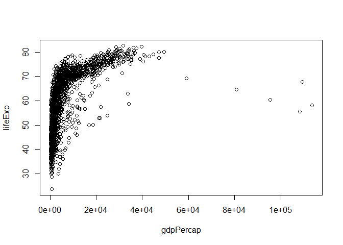

R Markdown for data exploration homework
================

Setting up
----------

The data we'll analyze is contained in the `gapminder` R package. If not installed, run `install.packages("gapminder")` first.

``` r
library(gapminder)
```

    ## Warning: package 'gapminder' was built under R version 3.4.4

Exploration of data frame
-------------------------

### Basic info of the data frame

Basic functions like `str`, `names`, `ncol`, `nrow`, `summary` help to get an overview of the data frame.

``` r
str(gapminder) #explores the structure of the data
```

    ## Classes 'tbl_df', 'tbl' and 'data.frame':    1704 obs. of  6 variables:
    ##  $ country  : Factor w/ 142 levels "Afghanistan",..: 1 1 1 1 1 1 1 1 1 1 ...
    ##  $ continent: Factor w/ 5 levels "Africa","Americas",..: 3 3 3 3 3 3 3 3 3 3 ...
    ##  $ year     : int  1952 1957 1962 1967 1972 1977 1982 1987 1992 1997 ...
    ##  $ lifeExp  : num  28.8 30.3 32 34 36.1 ...
    ##  $ pop      : int  8425333 9240934 10267083 11537966 13079460 14880372 12881816 13867957 16317921 22227415 ...
    ##  $ gdpPercap: num  779 821 853 836 740 ...

We have 6 variables: *country*, *continent*, *year*, *lifeExp* (life expentancy), *pop* (population), and *gdpPercap* (GDP per capita). Some are **numerical** and some are **categorical** (factors)

We can also see the variables using the function `names`

``` r
names(gapminder)
```

    ## [1] "country"   "continent" "year"      "lifeExp"   "pop"       "gdpPercap"

`ncol` and `nrow` will give us the number of columns and rows respectively

``` r
ncol(gapminder)
```

    ## [1] 6

``` r
nrow(gapminder)
```

    ## [1] 1704

Perhaps the most useful basic function is `summary`

``` r
summary(gapminder)
```

    ##         country        continent        year         lifeExp     
    ##  Afghanistan:  12   Africa  :624   Min.   :1952   Min.   :23.60  
    ##  Albania    :  12   Americas:300   1st Qu.:1966   1st Qu.:48.20  
    ##  Algeria    :  12   Asia    :396   Median :1980   Median :60.71  
    ##  Angola     :  12   Europe  :360   Mean   :1980   Mean   :59.47  
    ##  Argentina  :  12   Oceania : 24   3rd Qu.:1993   3rd Qu.:70.85  
    ##  Australia  :  12                  Max.   :2007   Max.   :82.60  
    ##  (Other)    :1632                                                
    ##       pop              gdpPercap       
    ##  Min.   :6.001e+04   Min.   :   241.2  
    ##  1st Qu.:2.794e+06   1st Qu.:  1202.1  
    ##  Median :7.024e+06   Median :  3531.8  
    ##  Mean   :2.960e+07   Mean   :  7215.3  
    ##  3rd Qu.:1.959e+07   3rd Qu.:  9325.5  
    ##  Max.   :1.319e+09   Max.   :113523.1  
    ## 

### Plots

Plots help visualizing data, we use `plot` to make basic graphs in R

``` r
plot(lifeExp ~ year, gapminder)
```


``` r
plot(lifeExp ~ gdpPercap, gapminder)
```



### Extracting columns or variables

To specify a single variable from a data frame, use the dollar sign $. We can extract a single variable and save the data in a new vector (not very useful in this case though).

``` r
LE <- gapminder$lifeExp # saves the vector of life expectancy
```

Now we know how to extract a variable, we can plot variables more easily. Lets try a couple more types of plots

### Histograms

Another basic kind of plot are the histograms, for these we use `hist`. Let’s explore the numeric variable for life expectancy.

``` r
summary(gapminder$lifeExp)
```

    ##    Min. 1st Qu.  Median    Mean 3rd Qu.    Max. 
    ##   23.60   48.20   60.71   59.47   70.85   82.60

``` r
hist(gapminder$lifeExp)
```


### Bar plots

Using `str` we see the variables *continent* and *country* are categorical (factors). We can try plotting the number of countries in each continent with a bar plot.

``` r
str(gapminder$continent)
```

    ##  Factor w/ 5 levels "Africa","Americas",..: 3 3 3 3 3 3 3 3 3 3 ...

``` r
barplot(table(gapminder$continent))
```


#### Boxplots

Let's also try a `boxplot` to look at the life expentacy by continent. this shows the median, lower and upper quartiles and the max and min values.

``` r
boxplot(gapminder$lifeExp ~ gapminder$continent)
```


